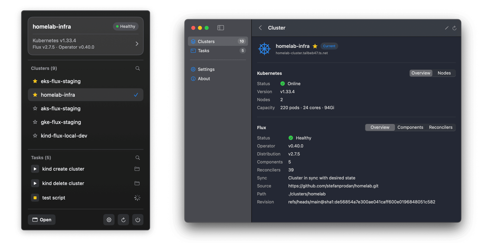

# KSwitch

[](https://github.com/stefanprodan/kswitch/releases)
[](https://github.com/stefanprodan/kswitch/actions/workflows/test.yaml)
[](https://developer.apple.com)
[](https://github.com/stefanprodan/kswitch/blob/main/LICENSE)

KSwitch is a native macOS app for managing Kubernetes contexts and monitoring
[Flux Operator](https://fluxoperator.dev) GitOps clusters directly from the menu bar.

<p align="center">
  
</p>

## Features

- **Quick Context Switching** - Switch between Kubernetes contexts from the menu bar
- **Cluster Status** - Shows Kubernetes version, nodes health, and cluster capacity
- **GitOps Monitoring** - Displays Flux Operator version, cluster sync status, and reconciler stats
- **Organization** - Mark clusters as favorites, hide unused ones, customize display names and colors
- **Notifications** - Get notified when clusters become degraded or Flux reconcilers fail

## Installation

### Requirements

- macOS 15.0 (Sequoia) or later
- kubectl installed and in `PATH`

### Download (Recommended)

Download the KSwitch zip file from [GitHub releases](https://github.com/controlplaneio-fluxcd/kswitch/releases),
unzip it, and move `KSwitch.app` to your Applications folder.
The app is code-signed and notarized for Gatekeeper.

Launch KSwitch from Applications and allow it to access your kubeconfig file when prompted.
By default, KSwitch uses `~/.kube/config` and auto-detects `kubectl` from your shell `PATH`.
You can specify multiple kubeconfig files and change the path to `kubectl` in the app settings.

While the app is running, it will check for new versions automatically and update itself if allowed.

### Build from Source

Clone, build, and launch:

```bash
git clone https://github.com/stefanprodan/kswitch.git
cd kswitch
make dev
```

Building the app requires the macOS SDK and Swift 6.2+ toolchain
wich comes with Xcode 26.2 or later.

## License

KSwitch is an open-source project licensed under the
[Apache-2.0 license](https://github.com/stefanprodan/kswitch/blob/main/LICENSE).
